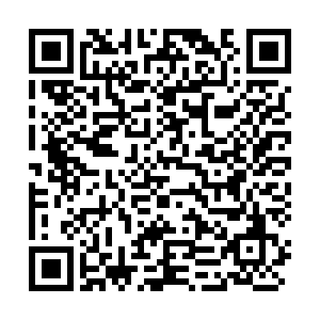

# Impuestos Bolivianos .NET

## ¿Qué es esto?

Biblioteca .NET para:
* Pasar Montos de Factura a Cadena.
* Calcular Códigos de Control de Facturas.
* Calcular Códigos QR de Facturas.

Expone también una interfaz de COM (*Component Object Model*). Esto permite, entre otras cosas, que se pueda invocar desde macros de Microsoft Word, Microsoft Excel, etc.

Cumple con:
* La [Descripción de los Números Cardinales de la Real Academia Española](docs/CriteriosNrosCardinales2005.pdf).
* La [Resolución Normativa "RND10-0021-16: SISTEMA DE FACTURACIÓN VIRTUAL"](docs/RND10-0021-16.pdf).
* La [Especificación Técnica del Código de Control Versión 7](docs/CodigoControlV2007.pdf).

Requiere:
* .NET Framework 3.5 o superior.

## Ejemplos de uso en C#

### Generar Código de Control

Uso:

```csharp
ImpuestosBolivianos.Facturacion.MakeControlCode(
    nroAutorizacion,
    nroFactura,
    nitCliente,
    fechaEmision,
    montoTotal, 
    llaveDosificacion);
```

Ejemplo de uso:

```csharp
ImpuestosBolivianos.Facturacion.MakeControlCode(
    1004001364255L,
    227830,
    "2211360015",
    new DateTime(2008, 08, 24),
    46770.0m,
    @"SYkajn$V4mNV8n$DiGBeNqgN+6ZViD5*Keg_sjS[BDPb%PQMADpfb3VDc6(Dz\GL");
```

Salida del ejemplo:

```csharp
> "4B-A3-E1-1C-5B"
```

### Generar Código QR

Uso:

```csharp
ImpuestosBolivianos.Facturacion.RenderPngQrCode(
    nroAutorizacion,
    nroFactura,
    nitCliente,
    fecha,
    importeTotal,
    codigoControl,
    nitEmisor,
    importeBaseCf,
    importeIceIehdTasas,
    importeVentasNoGravadas,
    importeNoSujetoCf,
    descuentosBonosRebajas);
```

Ejemplo de uso:

```csharp
ImpuestosBolivianos.Facturacion.RenderPngQrCode(
    471625511829685L,
    876814,
    "7904006306693",
    new DateTime(2008, 5, 19),
    35958.60m,
    "7B-F3-48-A8",
    "1665979",
    35958.60m,
    0.00m,
    0.00m,
    0.00m,
    0.00m);
```

Salida del ejemplo:



### Pasar Monto a Cadena

Código:

```csharp
ImpuestosBolivianos.Facturacion.StringifyInvoiceAmount(monto);
```

Ejemplo de uso:

```csharp
ImpuestosBolivianos.Facturacion.StringifyInvoiceAmount(1000.5m);
```

Salida del ejemplo:

```csharp
> "UN MIL 50/100"
```
